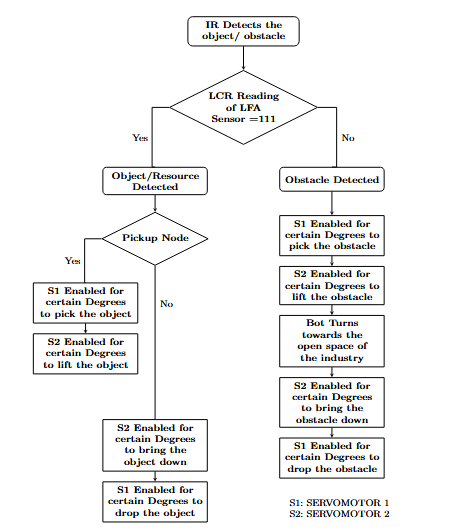
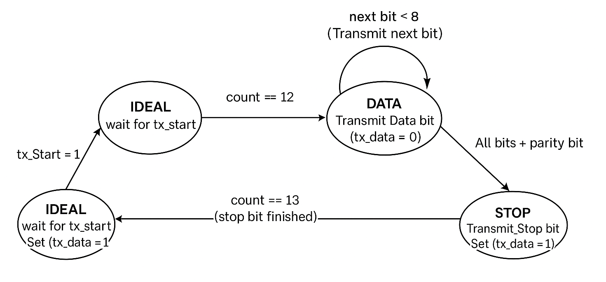

# FPGA Module Reference — Industrial Cobot Navigation System

**Processor:** RV32I Single-Cycle RISC-V  
**Clock Frequency:** 3.125 MHz  
**Hardware Description Language:** Verilog  
**Software Used:** Intel Quartus Prime
 **FPGA Used:** DE0Nano Board
  

This document describes the hardware architecture and module organization of the **Industry 5.0 FPGA-based robotic navigation platform** designed for autonomous industrial cobot operations.

---

## Table of Contents

1. [System Architecture and Design Methodology](#1-system-architecture-and-design-methodology)
2. [Input and Preprocessing Unit](#2-input-and-preprocessing-unit)
   - [UART Receiver and Message Decoder](#21-uart-receiver-and-message-decoder)
   - [Color Sensor Controller](#22-color-sensor-controller)
   - [ADC Controller](#23-adc-controller)
3. [Processing Unit](#3-processing-unit)
   - [RISC-V CPU Architecture](#31-risc-v-cpu-architecture)
   - [Shortest Path Loader (BFS Algorithm)](#32-shortest-path-loader-bfs-algorithm)
   - [Reset Module](#33-reset-module)
4. [Post Processing Unit](#4-post-processing-unit)
   - [CPU Path Arbitrator](#41-cpu-path-arbitrator)
   - [Turn and Node Controller](#42-turn-and-node-controller)
   - [Industry Turns Graph](#43-industry-turns-graph)
   - [LFA Controller](#44-lfa-controller)
   - [PWM Motor Controller](#45-pwm-motor-controller)
5. [Object Handling and Communication Unit](#5-object-handling-and-communication-unit)
   - [Object Handling](#51-object-handling)
   - [Obstacle Handling](#52-obstacle-handling)
   - [Communication Unit](#53-communication-unit)
   - [TX Controller for Message Sequencing](#54-tx-unit)
   - [Clock Domain Crossing (CDC) Handling](#55-cdc-unit)
6. [System Summary](#system-summary)

---
# 1. System Architecture and Design Methodology

The proposed **Industry 5.0 robotic platform** integrates FPGA-based control with mechanical and sensor components to enable autonomous navigation and object manipulation within an industrial workspace.

The architecture is organized into four major subsystems:

1. Input and Preprocessing Unit  
2. Processing Unit  
3. Post Processing Unit  
4. Object Handling and Communication Unit  

### Core Hardware Components

- DC geared motors  
- L298N motor driver  
- Servo actuators  
- Color sensors  
- Infrared sensors  
- Ultrasonic sensors  
- Line Following Array (LFA)

These components collectively enable real-time sensing, navigation, and industrial object handling.

The design follows a **hardware–software co-design approach**:

- **FPGA logic** performs sensor interfacing and signal processing.
- **Embedded RISC-V CPU** performs decision making and path planning.

---

# 2. Input and Preprocessing Unit

The Input and Preprocessing Unit captures sensor signals and communication data and converts them into structured digital information for the processing unit.

This unit consists of three main modules:

- UART Receiver and Message Decoder  
- Color Sensor Controller  
- ADC Controller  

---

# 2.1 UART Receiver and Message Decoder

This module forms the **communication interface between the human–cobot center and the FPGA robot**.

Communication occurs via a **Bluetooth HC-05 module**, enabling wireless command transmission.

### Hardware Interface

The **TX pin of the HC-05** is connected to the **UART RX input of the FPGA**.

UART parameters:

| Parameter | Value |
|-----------|------|
| Baud Rate | 115200 bps |
| Clock Frequency | 3.125 MHz |

The UART receiver detects a **start bit (logic 0)** and begins synchronized sampling.

---

### UART Packet Structure

Each UART frame contains:

| Field | Bits |
|------|------|
| Start Bit | 1 |
| Data Bits | 8 |
| Parity Bit | 1 |
| Stop Bit | 1 |

Sampling occurs every **27 clock cycles** to maintain mid-bit alignment.

Received data is stored in an **8-bit register `rx_msg`**.  
When the stop bit is detected and parity verified, the signal **`rx_complete`** is asserted.

---

### Message Command Format

Commands follow a structured syntax:
SCT-PU1-UID01-SN03-EN07#

Meaning:

- **SCT** → Scanning task  
- **PU1** → Prototyping Unit 1  
- **UID01** → Unit Identifier  
- **SN03** → Start Node  
- **EN07** → End Node  

---

### Supported Task Codes

| Code | Description |
|-----|-------------|
| SCT | Scanning Task |
| FU | Fabrication Unit |
| WU | Waste Unit |
| SU | Storage Unit |

---

### Emergency Task Syntax

Emergency tasks follow:
EMG-<UnitID>-<SN>-<EN>#

Example:
EMG-PU2-UID15-SN04-EN06#

When detected:

- The decoder prioritizes the **EMG header**
- Current tasks are suspended
- A new shortest path is computed
- **Red LEDs activate** to signal emergency operation.

---

### CPU Task Priority

Tasks are executed using the following priority order:
Emergency > Aiding > Scanning

Decoded parameters are written to **CPU data memory** for path planning.

---

# 2.2 Color Sensor Controller

The **Color Sensor Controller** detects color-coded objects or environmental conditions.

The system uses the **TCS3200 color sensor**, which produces **frequency-encoded RGB signals**.

### FSM States
F_GREEN
F_RED
F_BLUE
COLOR_DECISION
CLEAR

### Frequency Counters

| Counter | Color |
|--------|------|
| C1 | Green |
| C2 | Red |
| C3 | Blue |

The dominant frequency determines the detected color.

The module outputs:

- **2-bit color code**
- **task trigger signal**

This signal activates aiding or scanning tasks.

---

# 2.3 ADC Controller

The ADC controller digitizes analog signals from the **Line Following Array (LFA)** sensors.

The LFA contains three sensors:

- Left
- Center
- Right

The ADC sequentially samples each channel and converts the signals into digital values used by the **line-following navigation algorithm**.

---

# 3. Processing Unit

The Processing Unit consists of a **single-cycle RV32I RISC-V CPU** operating at **3.125 MHz**.

Responsibilities include:

- Path planning  
- Decision making  
- Navigation algorithm execution  

---

# 3.1 RISC-V CPU Architecture

### Instruction Memory

- Width: 32 bits  
- Depth: 512 words  

Stores the compiled **C navigation program implementing BFS**.

---

### Data Memory

- Width: 32 bits  
- Depth: 64 words  

Stores:

- Start node
- End node
- Visited array
- Queue
- Parent array

---

### Register File

Temporary storage for intermediate computation results.

---

### Arithmetic Logic Unit (ALU)

Performs arithmetic and logical operations required by instructions.

---

### Controller and Decoder

Generates control signals for:

- ALU
- Register file
- Memory modules

---

### Immediate Extension Unit

Extends immediate fields to **32-bit operands** for ALU operations.

---

# 3.2 Shortest Path Loader (BFS Algorithm)

The robot navigation graph represents the industrial floor layout.

- **Nodes** → Locations  
- **Edges** → Valid movement paths  

### BFS Workflow

1. Initialize start node  
2. Enqueue neighboring nodes  
3. Track parent nodes  
4. Mark nodes visited  
5. Continue until destination found  
6. Reconstruct shortest path  
7. Store the path in data memory  

This path is used by the motion controller.

---

# 3.3 Reset Module

After path computation:

- Temporary registers  
- Counters  
- Memory variables  

are cleared to prepare for the next navigation task.

---

# 4. Post Processing Unit

The Post Processing Unit converts the computed path into **motor control commands**.

It includes:

- CPU-Path Arbitrator  
- Turn and Node Controller  
- Industry Turns Graph  
- LFA Controller  
- PWM Motor Controller  

---

# 4.1 CPU Path Arbitrator

Reads the computed path from CPU memory and loads it into a local buffer.

A counter tracks node traversal and signals completion.

---

# 4.2 Turn and Node Controller

Processes node triplets:
(previous node, current node, next node)

Possible actions:

- Straight
- Left turn
- Right turn
- U-turn
- Reverse

---

# 4.3 Industry Turns Graph

A lookup table that maps node transitions to robot movement actions.

This ensures deterministic navigation without complex runtime computation.

---

# 4.4 LFA Controller

The Line Following Array controller interprets sensor combinations.

| L | C | R | Action |
|---|---|---|-------|
| 0 | 1 | 0 | Straight |
| 1 | 0 | 0 | Left correction |
| 0 | 0 | 1 | Right correction |
| 1 | 0 | 1 | Straight |
| 1 | 1 | 0 | Left merge |
| 0 | 1 | 1 | Right merge |
| 0 | 0 | 0 | Straight |
| 1 | 1 | 1 | Node detected |

When `111` occurs the robot detects a **node** and may stop or change direction.

---

# 4.5 PWM Motor Controller

Two PWM generators control motor speeds:

- Left motor pair  
- Right motor pair  

Differential duty cycles allow smooth turns.

Motor commands are executed through the **L298N motor driver**.

---

# 5. Object Handling and Communication Unit

This subsystem manages:

- Object manipulation  
- Obstacle removal  
- Actuator control  
- Communication with the human–cobot center  

---

# Object / Obstacle Flow

---

# 5.1 Object Handling

Objects are detected using the **IR sensor** when the robot reaches a node (`LFA = 111`).

A **2-DOF actuator** performs pick-and-place operations.

| Servo | Function |
|------|---------|
| S1 | Gripping / releasing |
| S2 | Vertical lifting |

After placement, a completion signal is sent to the CPU.

---

# 5.2 Obstacle Handling

If an obstacle is detected during navigation:

1. Grip obstacle  
2. Lift obstacle  
3. Move to safe location  
4. Lower obstacle  
5. Release obstacle  
6. Resume navigation  

---

## 5.3 Communication Handling and UART Transmission

The **Communication Module** enables reliable interaction between the FPGA robot and the **Human–Cobot Center** using UART communication.

It performs two main tasks:

- Receiving command packets through the **UART Receiver**
- Transmitting completion messages through the **UART Transmitter**

Data transmission operates at:

| Parameter | Value |
|----------|------|
| Baud Rate | 11,520 bps |
| System Clock | 3.125 MHz |

The UART transmitter is controlled by a **four-state FSM**:

| State | Function |
|------|---------|
| Idle | Wait for transmission request |
| Start | Transmit start bit |
| Data | Send 8-bit message data |
| Stop | Send stop bit and complete transmission |

After each **pick-and-place operation** performed by the **2-DOF actuator**, a formatted completion message is transmitted to the Human–Cobot Center.

Example transmitted message:
PSU-P1-Complete-Red#

Where:

- `PSU` → Prototyping Sub Unit  
- `P1` → Position identifier  
- `Complete` → Task status  
- `Red` → Detected object color  

A **green LED indicator** is activated to signal successful message transmission.

---

### UART Transmitter FSM

*Figure: Finite State Machine of the UART Transmitter.*

---

## 5.4 TX Controller for Message Sequencing

The **TX_Controller** manages the correct ordering of outgoing messages and ensures reliable UART transmission.

Its responsibilities include:

- Monitoring `subunit_done` flags from actuator operations
- Generating `tx_start` pulses to trigger the UART transmitter
- Sending characters sequentially
- Waiting for `tx_done` acknowledgment after each byte transmission

### Message Termination

Each transmitted message ends with the delimiter: "#"

This delimiter indicates **end of packet** to the receiver system.

Internal counters and control flags are reset during **global initialization**, ensuring transmission integrity during continuous operation.

---

## 5.5 Clock Domain Crossing (CDC) Handling

Clock Domain Crossing (CDC) occurs because different modules in the system operate at different clock frequencies.

| Module | Clock Frequency |
|------|------|
| CPU and Communication Modules | 3.125 MHz |
| 2-DOF Actuator Control | 50 Hz |

Direct communication between these domains can cause **metastability issues**.

To solve this problem, the CDC module implements a **handshake-based synchronization mechanism**.

### CDC Mechanism Functions

- Safely transfer control signals across clock domains
- Prevent metastability
- Maintain correct timing relationships
- Ensure reliable actuator command execution

This synchronization mechanism guarantees **stable communication between high-speed computation blocks and low-frequency actuator controllers**.
---

# System Summary

| Unit | Function |
|----|----|
| Input & Preprocessing | Sensor acquisition and command decoding |
| Processing | Path planning and decision making |
| Post Processing | Motion control and navigation |
| Object Handling | Object manipulation and communication |

---
**All the modules can be updated based on the industrial scenario and can be scaled based on the requirements**
