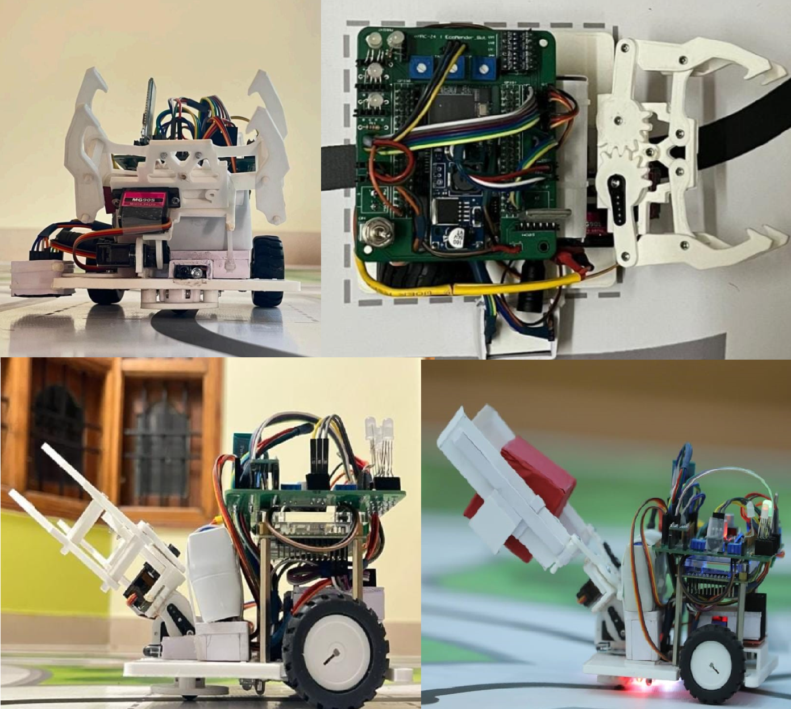

# Industrial Cobot Robot Platform

The developed system includes a **mobile industrial cobot robot** designed for autonomous navigation, object detection, and pick-and-place operations within an Industry 5.0 manufacturing environment. The robot integrates sensing, computation, actuation, and communication modules to enable collaborative tasks between humans and robotic systems.

The platform combines **FPGA-based control, embedded processing, and electromechanical components** to perform navigation, obstacle handling, and object manipulation inside an industrial workspace.

---

## Robot Structure and Mechanical Design

The robot is built on a **four-wheel differential drive mobile base**, allowing smooth navigation along predefined industrial paths. Two DC geared motors drive the wheels through an **L298N motor driver**, while the chassis houses the FPGA board, communication modules, and sensor units.

Mounted on the front of the robot is a **2-Degree-of-Freedom (2-DOF) actuator system** used for pick-and-place operations. The actuator consists of two servo motors that enable vertical lifting and gripping of objects.

The mechanical frame is designed to support:

- sensor placement
- actuator stability
- efficient weight distribution
- easy maintenance of electronic components

---

## Degrees of Freedom (DOF)

The robot manipulator provides **2 Degrees of Freedom (2-DOF)**:

| Servo | Function | Motion |
|------|----------|--------|
| Servo 1 | Gripper control | Open / Close |
| Servo 2 | Lift actuator | Up / Down |

These two DOF allow the robot to:

- grip objects
- lift them from the workspace
- place them at designated locations

The actuator is mounted on the front side of the robot to allow direct interaction with objects detected during navigation.

---

## Robot Hardware Components

The robot integrates several electronic and mechanical components that work together to perform sensing, computation, navigation, and manipulation.

### Processing and Control

- **FPGA development board**
- **RISC-V processor implemented on FPGA**
- **UART communication interface**

The FPGA performs real-time signal processing, communication handling, and coordination between sensors and actuators.

---

### Motion System

The motion subsystem enables robot navigation across the industrial floor.

Components include:

- **DC geared motors (x2)**
- **Four-wheel chassis**
- **L298N motor driver module**
- **PWM motor control circuits**

Differential motor control allows the robot to perform:

- straight motion
- left and right turns
- node-based navigation

---

### Sensor System

Multiple sensors provide environmental awareness.

| Sensor | Purpose |
|------|------|
| Line Following Array (LFA) | Path tracking |
| Infrared (IR) sensor | Object detection |
| IR sensor | Obstacle detection |
| Color sensor (TCS3200) | Object color identification |

These sensors enable the robot to operate autonomously in a structured industrial environment.

---

### Actuator System

The **2-DOF robotic actuator** performs pick-and-place operations.

Components include:

- **Servo motor S1** – object gripping
- **Servo motor S2** – vertical lifting mechanism

The actuator is controlled using **PWM signals generated by the FPGA**, allowing precise motion control.

---

### Communication System

Wireless communication with the **Human–Cobot Center** is implemented using:

- **Bluetooth HC-05 module**
- **UART communication protocol**

This communication channel allows the robot to:

- receive task commands
- transmit task completion messages
- report system status

---

## Robot Overview

The robot used in this work is shown below with multiple perspectives including:

- **Front view**
- **Top view**
- **Side view**
- **Object handling demonstration**

*Figure: Multi-view representation of the developed industrial cobot robot showing the mechanical structure, actuator assembly, and object manipulation capability.*

---
